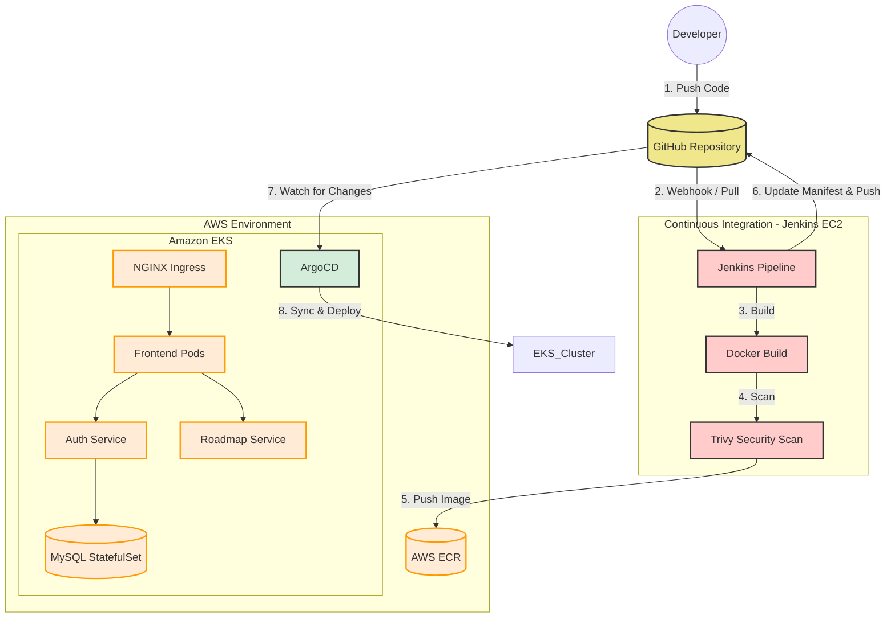

# ☁️ End-to-End Cloud DevOps & GitOps Project


## 📖 Project Overview
This project is a comprehensive implementation of a modern DevOps CI/CD pipeline and GitOps workflow. It provisions a highly available infrastructure on AWS, configures a CI server, builds and containerizes a microservices application, and deploys it to a Kubernetes cluster (EKS) automatically using ArgoCD.

---

## 🏛️ Architecture & Workflow Diagram



---

## 🛠️ Technology Stack
* **Cloud Provider:** AWS (VPC, EC2, EKS, ECR, S3, IAM, NAT Gateway, NACL)
* **Infrastructure as Code (IaC):** Terraform (with S3 remote backend & DynamoDB state locking)
* **Configuration Management:** Ansible (Dynamic Inventory, Roles)
* **Containerization:** Docker & Docker Compose
* **Security & Vulnerability Scanning:** Trivy
* **Continuous Integration (CI):** Jenkins (with Groovy Shared Library)
* **Continuous Deployment (CD) / GitOps:** ArgoCD
* **Container Orchestration:** Kubernetes (Deployments, Services, StatefulSets, ConfigMaps, Secrets, Ingress)

---

## 🚀 Step-by-Step Setup Instructions

### 1. Infrastructure Provisioning (Terraform)
Navigate to the `Terraform` directory to provision the AWS infrastructure (VPC, Subnets, Jenkins EC2, EKS Cluster, ECR Repo).
```bash
cd Terraform
terraform init
terraform apply -auto-approve
```

### 2. Configuration Management (Ansible)
Navigate to the `Ansible` directory to configure the Jenkins EC2 instance using a dynamic inventory. This will install Java 21, Jenkins, Docker, and Trivy.
```bash
cd ../Ansible
ansible-playbook -i inventory_aws_ec2.yml playbook.yml -u ubuntu --private-key ~/.ssh/your-key.pem --ssh-common-args='-o StrictHostKeyChecking=no'
```

### 3. CI Pipeline Setup (Jenkins)
1. Access Jenkins via `http://<JENKINS_PUBLIC_IP>:8080`.
2. Retrieve the initial admin password from the server.
3. Install suggested plugins and set up admin credentials.
4. Add GitHub and AWS credentials in Jenkins.
5. Configure the Global Pipeline Shared Library pointing to the `jenkins-shared-library` repository.
6. Create multibranch pipelines for `auth-service`, `roadmap-service`, and `frontend` using their respective `Jenkinsfile`s.

### 4. GitOps CD Setup (ArgoCD & Kubernetes)
Install ArgoCD on the EKS cluster and apply the declarative GitOps application manifest:
```bash
# Apply OIDC & EBS CSI Driver IAM Role (Terraform)
# This allows StatefulSets to dynamically provision EBS volumes.

# Install Ingress Controller
kubectl apply -f https://raw.githubusercontent.com/kubernetes/ingress-nginx/controller-v1.11.2/deploy/static/provider/aws/deploy.yaml

# Apply ArgoCD Application Manifest
kubectl apply -f argocd/application.yml
```
ArgoCD will automatically sync the manifests from the `kubernetes/` directory and deploy the entire microservices architecture.

### 5. Accessing the Application
Once ArgoCD syncs the application and the Load Balancer is provisioned by the Ingress Controller, retrieve the application URL:
```bash
kubectl get ingress -n ivolve
```
*Copy the `ADDRESS` provided and open it in your browser!*

---

## 🧹 Cleanup
To avoid unexpected AWS charges, destroy all provisioned infrastructure once done:
```bash
cd Terraform
terraform destroy -auto-approve
```