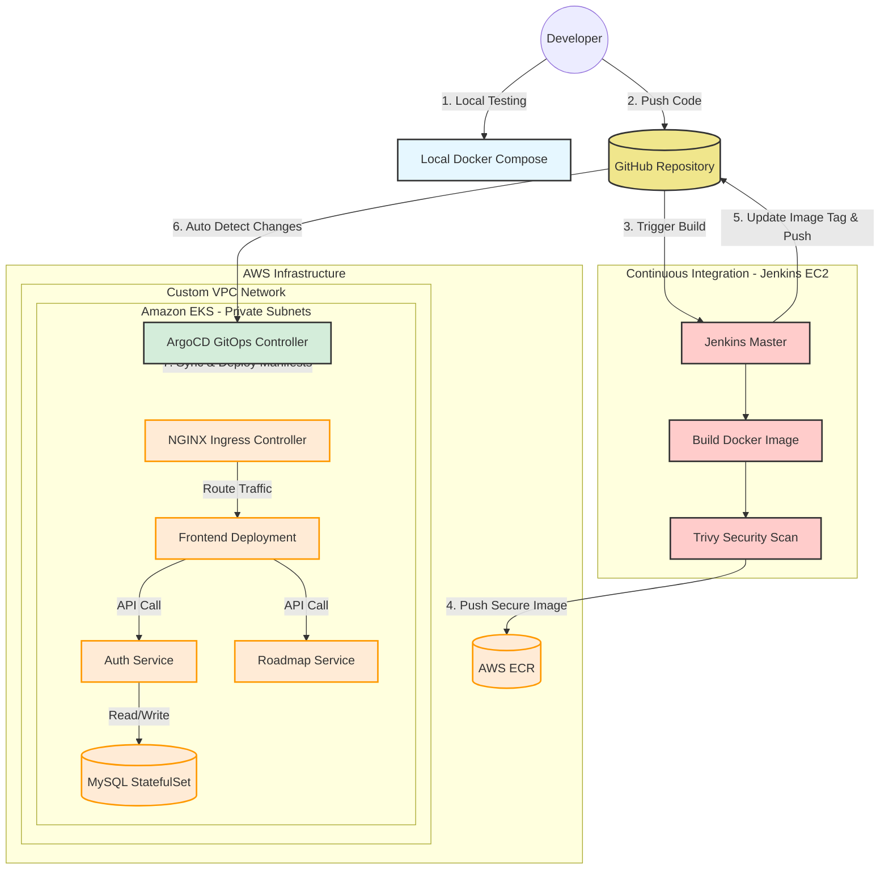

# ☁️ End-to-End Cloud DevOps & GitOps Project

## 📖 Project Overview
This project is a comprehensive implementation of a modern DevOps CI/CD pipeline and GitOps workflow for a microservices-based application. It covers the entire software development lifecycle: from local containerization and infrastructure provisioning to continuous integration, security scanning, and declarative continuous deployment using GitOps principles.

---

## 🏛️ Architecture & Workflow Diagram

---

## 🛠️ Technology Stack & Project Details

* **Local Environment:** `Docker` & `Docker Compose` for testing the Microservices (Frontend, Auth, Roadmap, Database) locally.
* **Cloud Provider:** `AWS` (Custom VPC, Public/Private Subnets, IGW, NAT Gateway, NACL, Route Tables).
* **Infrastructure as Code (IaC):** `Terraform` (Modular architecture with S3 remote backend).
* **Configuration Management:** `Ansible` (Dynamic AWS Inventory, Roles for Java, Jenkins, Docker, and Trivy).
* **Continuous Integration (CI):** `Jenkins` (Groovy Shared Library to dynamically build, scan, push, and update manifests).
* **Security Scanning:** `Trivy` (Scanning Docker images for HIGH & CRITICAL vulnerabilities).
* **Container Registry:** `AWS ECR` (Storing immutable Docker images with unique build tags).
* **Continuous Deployment (CD):** `ArgoCD` (GitOps controller inside the cluster to automatically sync GitHub manifests).
* **Container Orchestration:** `Kubernetes / Amazon EKS` (Deployments, ClusterIP Services, Headless Services, StatefulSets with EBS CSI Driver, ConfigMaps, Secrets).
* **Ingress Controller:** `NGINX` mapped to an AWS Load Balancer for external traffic routing.

---

## 🚀 Project Execution Phases

### Part 1 & 2: Local Setup & Containerization
- Cloned the application source code.
- Created a `docker-compose.yml` to build and test the microservices and MySQL database locally to ensure cross-service communication works.

### Part 3: Infrastructure Provisioning (Terraform)
- Provisioned a custom VPC with Public and Private subnets across multiple Availability Zones.
- Deployed a Jenkins EC2 instance in the public subnet.
- Deployed an EKS Cluster with managed Node Groups residing in private subnets.
- Created an Elastic Container Registry (ECR).

### Part 4: Configuration Management (Ansible)
- Configured the EC2 instance automatically using an Ansible Playbook and AWS Dynamic Inventory.
- Installed dependencies: Java 21, Jenkins, Docker, and Trivy via dedicated Ansible roles.

### Part 5: Container Orchestration (Kubernetes Manifests)
- Created a custom namespace for the application.
- Developed `Deployment` and `Service` manifests for Frontend, Auth, and Roadmap services.
- Created a `StatefulSet`, `Headless Service`, and `StorageClass` for the MySQL database.
- Centralized environment variables and secrets using `ConfigMap` and `Secret`.
- Exposed the frontend via an `Ingress` resource.

### Part 6: Continuous Integration (Jenkins)
- Implemented a Groovy Shared Library to standardize the pipeline steps for all microservices.
- The pipeline stages include: Building the image, scanning with Trivy, pushing to ECR, updating the Kubernetes deployment manifest with the new image tag, and pushing the changes back to GitHub.

### Part 7: Continuous Deployment (ArgoCD & GitOps)
- Installed ArgoCD on the EKS cluster.
- Applied an ArgoCD `Application` manifest that monitors the GitHub repository.
- ArgoCD automatically detects the new image tags pushed by Jenkins and syncs the changes to the EKS cluster without manual intervention.

---

## 🧹 Infrastructure Cleanup
To prevent unwanted AWS billing, destroy the infrastructure:
1. Run `terraform destroy -auto-approve` inside the Terraform directory.
2. Manually delete any lingering EBS volumes or Load Balancers in the AWS Console if necessary.